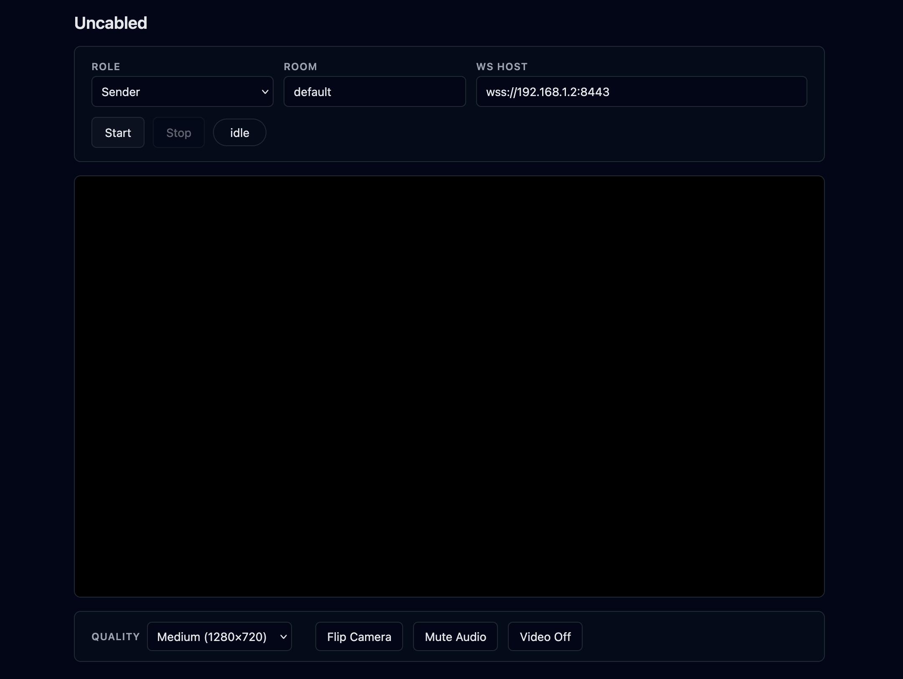
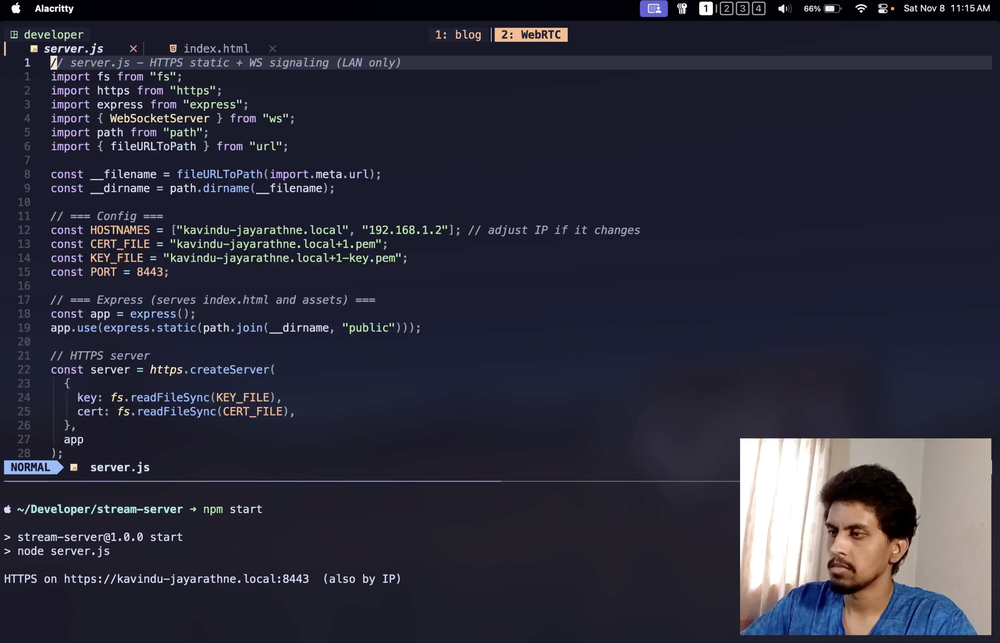

# Uncabled



Use your phone (or any device with a camera) as a virtual camera for OBS, powered by the WebRTC protocol.

Built for content creators who want a face cam setup for streaming or recording but don't have the budget for professional cameras, capture cards, and cables. All you need is your phone, your computer, and a local network.

Uncabled turns any device with a camera and a browser into a wireless camera feed that you can view on another device. No capture cards, no cables, no extra apps. Both devices just need to be on the same LAN. The device you want to use as a camera (your phone, a spare laptop, a tablet) acts as the **sender**, and the device where you want to see the feed acts as the **receiver**. They connect peer-to-peer using WebRTC.

To use the feed for streaming or recording, pair it with software like OBS. Add the receiver as a browser source in OBS, and you have a wireless face cam overlay for your content. You can also use OBS as a virtual camera, which means any website or app that expects a webcam (video calls, chat sites, online meetings) can use your phone's camera feed instead of your laptop's built-in webcam.

You don't need OBS for everything though. If you just want to monitor a camera feed, you can use the web interface directly. Place a phone somewhere as a security camera and watch the feed from your computer, no extra software needed.

**Output:**



## How It Works

Uncabled runs a small HTTPS server on your computer that serves a web interface and handles WebRTC signaling via WebSocket.

1. The **sender** device opens the web interface and captures its camera and microphone
2. The **receiver** device opens the same interface and displays the incoming video feed
3. The two peers connect directly over WebRTC (peer-to-peer on your local network)
4. For OBS usage, you add the receiver URL as a **browser source**, giving you a wireless face cam

The signaling server only helps the two peers find each other. Once connected, the video and audio flow directly between devices with minimal latency.

## Prerequisites

- [Node.js](https://nodejs.org/) (v18 or later)
- Both devices on the same local network
- TLS certificate files for the HTTPS server (see below)

## Setup

### 1. Clone and install

```bash
git clone https://github.com/kavindujayarathne/uncabled.git
cd uncabled
npm install
```

### 2. Generate TLS certificates

The server uses HTTPS, which requires a TLS handshake to encrypt the connection between the browser and the server. For this handshake, the server needs a public/private key pair (`cert.pem` and `key.pem`). HTTPS will not work without them.

The recommended way to generate these keys is [mkcert](https://github.com/FiloSottile/mkcert).

#### Install mkcert

```bash
brew install --formula mkcert        # macOS
# or: sudo apt install mkcert   # Debian/Ubuntu
# or: choco install mkcert      # Windows
```

#### Generate the key pair

Generate the keys using your machine's LAN IP (this is the machine running the server):

**macOS:**
```bash
mkcert -cert-file cert.pem -key-file key.pem $(ipconfig getifaddr en0)
```

**Linux:**
```bash
mkcert -cert-file cert.pem -key-file key.pem $(hostname -I | awk '{print $1}')
```

**Windows:**

Find your IP with `ipconfig`, then pass it manually:
```bash
mkcert -cert-file cert.pem -key-file key.pem YOUR_LAN_IP
```

**Note:** The IP address is baked into the certificate. If your router assigns a different IP to your server machine later, you will need to regenerate the keys with the new IP.

#### Browser "Not Secure" warning

After generating the keys, HTTPS works and the camera access works. However, your browser will show a "Not Secure" warning because the certificate is not trusted by the browser yet. This is completely harmless since everything runs on your local network. You can accept the warning and continue.

If you want to remove the warning, install the mkcert CA into the trust store:

**On your computer (one-time setup):**
```bash
mkcert -install
```

This installs the mkcert root CA into your system trust store. Your laptop browser will now show a green lock instead of the warning.

**On your iPhone (optional):**
1. Find the mkcert root CA file by running `mkcert -CAROOT` and transfer it to your phone
2. Open the file on your phone, go to Settings > General > VPN & Device Management and install the profile
3. Go to Settings > General > About > Certificate Trust Settings and enable the CA

**On your Android phone (optional):**
1. Transfer the mkcert root CA file to your phone
2. Go to Settings > Security > Encryption & Credentials > Install a certificate > CA certificate
3. Select the CA file

#### Alternative: openssl

If you prefer not to install mkcert, you can generate self-signed certificates with openssl:

```bash
openssl req -x509 -newkey rsa:2048 -keyout key.pem -out cert.pem -days 365 -nodes \
  -subj "/CN=uncabled" -addext "subjectAltName=IP:YOUR_LAN_IP"
```

For example:
```bash
openssl req -x509 -newkey rsa:2048 -keyout key.pem -out cert.pem -days 365 -nodes \
  -subj "/CN=uncabled" -addext "subjectAltName=IP:192.168.1.2"
```

This works the same way but the browser warning cannot be removed through a trust store setup like mkcert. You will need to accept the warning every time.

### 3. Configure environment

```bash
cp .env.example .env
```

Edit `.env` with your values:
```
TLS_CERT=cert.pem
TLS_KEY=key.pem
PORT=8443
```

### 4. Start the server

```bash
npm start
```

The server will print your LAN IP address. Open that URL on both devices.

## Usage

### Sender (camera device)

1. Open `https://<your-lan-ip>:8443` on the device you want to use as a camera
2. Set role to **Sender**
3. Enter a room name
4. Tap **Start**
5. Allow camera and microphone access when prompted

### Receiver (viewing device)

1. Open the same URL on the device where you want to see the feed
2. Set role to **Receiver**
3. Enter the **same room name** as the sender
4. Click **Start**

The sender's camera feed should appear on the receiver. Start the receiver first, then the sender.

### Controls (sender only)

- **Quality**: Switch between Low (640x360), Medium (720p), and High (1080p)
- **Flip Camera**: Toggle between front and rear camera
- **Mute Audio**: Mute/unmute the microphone
- **Video Off**: Turn the camera on/off

### OBS Integration

Use the built-in OBS shortcut URL to get a clean, full-screen video feed with no UI:

```
https://<your-lan-ip>:8443/obs-receiver/<room-name>
```

In OBS:
1. Add a new **Browser Source**
2. Set the URL to the OBS shortcut URL above
3. Set the width and height to match your stream resolution
4. Position and resize as needed

This URL auto-joins the room as a receiver with all UI elements hidden, perfect for overlaying your face cam on your stream or recording.

## Project Structure

```
uncabled/
├── public/
│   └── index.html          # Web interface (sender + receiver)
├── docs/
│   └── screenshots/        # Images for documentation
├── server.js               # HTTPS server + WebSocket signaling
├── .env.example            # Environment variable template
├── .gitignore
├── LICENSE
├── README.md
└── package.json
```

## License

[MIT](LICENSE)
